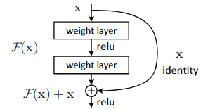
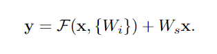
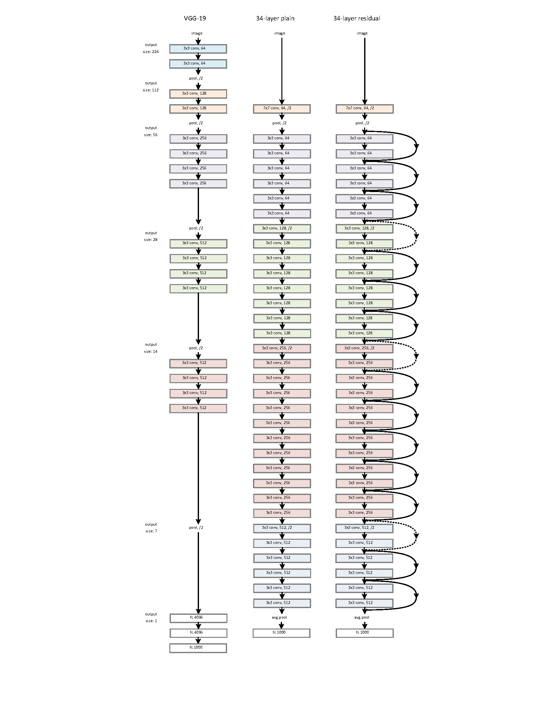

# 20211117 Resnet

>Deep Residual Learning for Image Recognition

## Abstract

为了解决深层网络难以训练的问题，文章提出了残差结构，该结构会去参考输入层。因为这些残差网络更容易优化，所以可以大幅增加深度来获得准确性。

On the ImageNet dataset we evaluate residual nets with a depth of up to 152 layers—8× deeper than VGG nets [41] but still having lower complexity. 

## Introduction

使用随机初始化和在网络中添加归一化层解决了梯度消失和梯度爆炸的问题，使得拥有数十层的网络开始收敛来进行SGD。

随后发现随着网络深度的增加，精度开始趋于饱和（退化问题），而且不是由于过拟合引起的。在适当深度的模型中增加更多的层会导致更高的训练误差。

输入由原来的F(x)变为F(x)+x。

shortcut connections(快捷连接)，可以跳过一个或者多个层直接添加到堆叠层的输出中，所以既不增加额外的参数，也不增加计算复杂性。

两个优点：1.容易优化，深度增加时误差增加更小；2.容易依靠增加深度提高准确性

## Related Work

### Residual Representations

It has been shown that these solvers converge much faster than standard solvers that are unaware of the residual nature of the solutions.

### Shortcut Connections

训练多层感知器(MLPs)的早期实践是添加一个从网络输入连接到输出的线性层。

有一些中间层直接连接到辅助分类器去处理梯度爆炸或梯度消失。

## Deep Residual Learning

### Residual Learning

### Identity Mapping by Shortcuts

F(x)和x的维数相同

不匹配时使用Ws去匹配维数。

但是实验表明identity mapping足够去解决退化问题而且开销很小，所以我们只在匹配维度时使用Ws。

适用于linear也适用于cnn

###  Network Architectures

#### Plain Network

受启发于VGG。大多使用3*3的卷积核并且有以下两个规则：1.对于相同的输出特征图大小，层有相同数量的过滤器；2.如果features map的大小减半，则滤波器的数量增加一倍，以保持每层的时间复杂度。

#### Residual Network

当维度增加时，有两种方法：1.仍然执行identity mapping，为增加的维度填充额外的零项，这种方法不会引入额外的参数。2.用1*1的卷积去匹配维数。For both options, when the shortcuts go across feature maps of two sizes, they are performed with a stride of 2。

###  Implementation

#### ImageNet Classification

比较plain net-18、plain net-34和resnet-18、resnet-34.

指出deep plain net优化困难，有指数级的丢收敛率。

resnet和plainnet相比有shortcut connection在每对3*3的卷积核之间。

resnet解决了退化问题，而且可以依靠增加深度来获得精度增益

**Identity vs. Projection Shortcuts** 

**Deeper Bottleneck Architectures**

###  CIFAR-10 and Analysis

在保证相同的深度、宽度和相同数量的权重参数的情况下更改模型来比较模型性能。

在训练时发现lr初始化为0.1时，会因为lr略大而无法开始收敛，所以先将学习率设为0.01进行预热训练，在训练误差低于80%（大约400epoch）的时候再使用0.1的lr进行训练。

#### Analysis of Layer Responses

比普通网络有更小的响应。越深的resnet有较小的相应范围

the residual functions might be generally closer to zero than the non-residual functions.

#### Exploring Over 1000 layers

超过千层的网络仍然有更好的结果。但是和110层的网络比起来，他有比较差的test error，虽然他们都有几乎一样的train error。我们认为这是因为过拟合。

或许可以通过强正则化来进行优化，比如dropout和maxout。

### Object Detection on PASCAL and MS COCO

使用faster R-CNN作为检测方法，用resnet-101代替VGG-16。使用这两种模型的检测实现(见附录)是相同的，所以增益只能归因于更好的网络。

