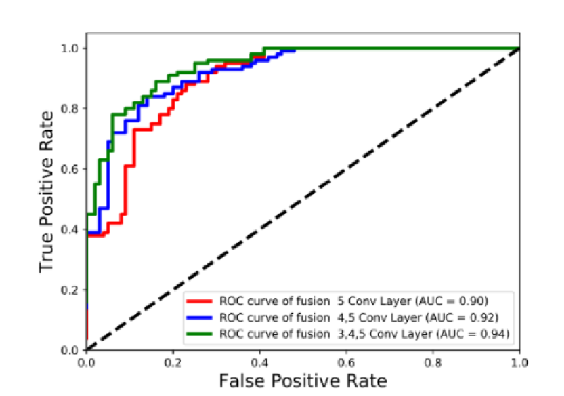

# 20211123 Integration of Multimodal Data for Breast Cancer Classification Using a Hybrid Deep Learning Method

> 基于混合深度学习方法的乳腺癌多模态数据集成

## Abstract

使用病理图像和EMR数据来提高精度。

## Intruduction

目前混合模型存在的一些问题：如图像的特征表示不够丰富，信息融合不够充分，特别是在数据融合之前没有解决高维信息丢失的问题。

1.第一次整合多模态数据诊断乳腺癌

2.多个卷积层

3.低维数据放大，而不是融合前降维

## Related word

**Multimodal data fusion：**多模态对象的各模态具有不同的特征，会导致异构数据的复杂性。因此，异构数据对多模态深度学习方法提出了另一个挑战。

**Richer  feature  representation：**多模态的前提是对单模态数据的特征提取。关键是不同模态数据的混个是否充分，所以混合前就要学习到比较丰富的特征。

**High-dimensional and low-dimensional data fusion：**图像为高维，表格为低维

数据融合：数据级融合、特征级融合和决策级融合

特征融合前尽可能保持各模式信息的完整。

## Method

EMR数据为29D，VGG提取的特征为1280D，使用29D * 20 + 1280D输入后面的全连接层。

### Richer feature representation 

 多层卷积层保留了被高层丢失的局部纹理和精细细节等互补信息。我们提取了VGG第三第四第五层的特征并用平均池化将其变为1 * 1 * n的特征

### High-dimensional and low-dimensional data fusion

复制低维向量使其具有和高维向量有相似的比重。（通过比较复制29D向量的倍数来做对比试验）

## Dataset

病理图像+EMR

**Pathological  image：**分为良性和恶性两种

**Structured data in EMR：**29个特征

## Experiments 

### Accuracy comparison with previous methods

### Accuracy comparison using different dimensional fusion

### ROC comparison using richer feature representation

使用不同层的特征作为输出。

## Conclusions

结构的通用性。

