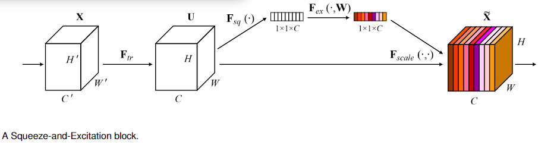

# Squeeze-and-Excitation Networks

## Abstract

之前对CNN的研究主要在关系的空间成分，试图通过在其特征层次中提高空间编码的质量来加强CNN的特征表达的能力。**本文主要关注通道关系，提出了SE block，通过明确建模通道之间的相互依赖，自适应地重新校准通道特征响应。**SEblock为现有的网络带来了明显的性能改进，只增加了很小的计算开销。

## Introduction

CNN主要用来处理视觉任务......

本论文研究了不同渠道之间的关系，引入了空间注意力机制Squeeze-and- Excitation (SE) block，网络可以学习使用全局信息来选择性地强调信息特征，抑制不太有用的特征。

我们将X映射成拥有相同尺度的张量U，U经过挤压后成为C × 1 × 1 的张量，然后经过encoder和decoder，生成新的C × 1 × 1 的张量，这会生成一个拥有信道特征相应的描述符来衡量X每层的权重。

可以通过一系列SEblock的堆叠来形成SEnet，也可以用SEblock代替其余网络的层。SE的权值也是可以通过网络来学习的，且参数很少。

## Related work

* deeper architectures：网络朝着更深的结构发展，但是也在想办法相对的减少参数和计算复杂度。在深度网络中提供一种机制，使用全局信息显式的建模信道之间的非依赖性关系。

* Algorithmic Architecture Search：试图用自动学习网络架构去替代手动设置网络架构。使用进化搜索来进行相关工作，虽然通常需要计算，但是已经取得了显著的成绩。为了减轻计算复杂度，已经提出了基于Lamarckian的遗传算法和可微分的搜索架构。还有超参数优化、随机搜索和其他复杂基于模型的优化技术也可以用来解决这个问题。强化学习也取得了比较好的结果。SEblock可以作为构建这些搜索子块的基础单元。
* Attention and gating mechanisms：注意力机制使计算资源偏向于更重要的地方。本文提出的主要是在channel维度建模。

## Sequeeze and excitation blocks

公式会得到原始数据和权重数据相乘后的结果，然后使用激活函数变换后输入到下一层。

### Squeeze: Global Information Embedding

首先使用全局池化得到每一层的均值，如下面公式所示：

### Excitation: Adaptive Recalibration

我们使用某些操作实现利用压缩操作中的聚合信息，完全捕获与通道相关的依赖关系。该层必须有两个标准：1.能够学习通道之间的非线性交互；2.能学习非互斥关系，因为我们希望确保允许多个通道被强调。

可以使用两个全连接层或者1×1的卷积层来实现。最后使用attn和x相乘。

### Instantiations

SEblock可以之间作用于Inception架构和resnet架构，可以之间融入网络。

## model and computational completely

在Resnet-50上做实验，参数仅仅增加了0.26%。但性能基本接近于resnet-101.

产生的参数有下列公式可计算：

## experiments

#### Image classification

* Network depth
* Integration with modern architectures
* Mobile setting
* Additional datasets

#### Scene Classification

#### Object Detection on COCO

#### ILSVRC 2017 Classification Competition

## ablation study

使用了数据增强。

#### Reduction ratio

在r = 16的时候取得了最好的结果。

#### Squeeze Operator

全局平均池化比全局最大池化的结果要好。

#### Excitation Operator

Sigmoid效果最好。

#### Different stages

在不同阶段引入SEblock来比较网络性能。

#### Integration strategy

SEblock在残差单元的不同位置的性能，SE-PRE, SE-Identity and proposed SE block都表现不错，但是SE-POST block 会导致网络性能下降，**说明要在分支聚合之前使用。**

(1) SE- pre，将SE块移动到残差单元之前;(2) SE- post，SEblock放在ReLU后;(3)SE- identity，SE单元与残差单元并行放置。

## role of SE block

#### Effect of Squeeze

降维操作对网络有较大的性能提升。

#### Role of Excitation

每个通道更倾向于特定的类，说明早期的层特征通常更一般化，而后期的层特征表现出更高水平的特异性。

## CONCLUSION

揭示了以前的体系结构无法充分建模通道方面的特性依赖的问题。

由SE块产生的特征重要值可用于其他任务，如模型压缩的网络剪枝。

