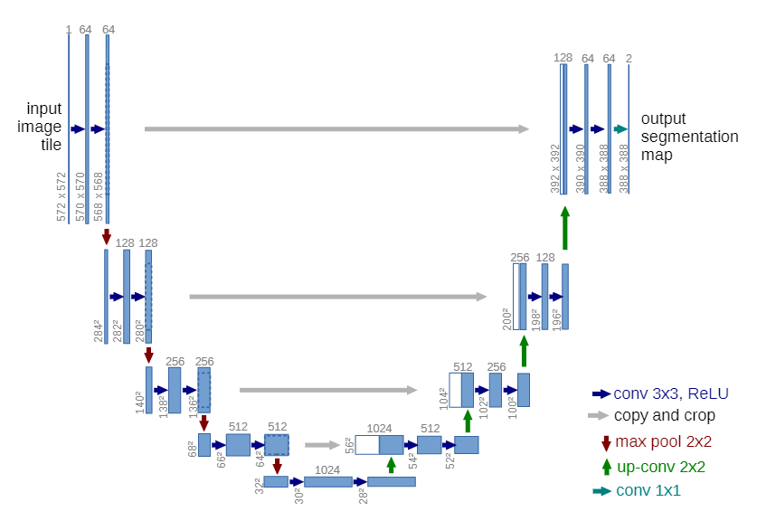

#  U-net 

> Convolutional Networks for Biomedical Image Segmentation

## Abstract

提出了一种网络和训练方式，可以使用数据增强的方式更高效的利用已标注数据。该网络包含了

a contracting path to capture context和a symmetric expanding path  that enables precise localization 。

## Introduction

识别任务是以整张图片为一个任务，而unet实现了对每个像素进行预测。

和FCN相比， 在上采样部分，我们还有大量的特征通道，允许网络将上下文信息传播到更高分辨率的层。 

网络没有任何全连接的层，只使用每个卷积的有效部分。

因为数据量较小，所以我们使用了多种数据增强策略。这允许网络去学习这些变形的不变性，但不需要在注s释的语料库中看到这些转换。数据增强在无监督学习中也有很大的作用。

## Network Architecture

前面分别使用卷积和反卷积去进行上采样和下采样，使用的都是3 * 3的卷积核，maxpooling都是使用的2 * 2的尺度，在最后一层使用1 * 1的卷积核进行channel的降维到需要的类别。

## Training

* SGD，momentum=0.99
* 由于没有填充卷积，输出图像比输入图像小一个恒定的边界宽度。

* 为了最小化开销和最大限度地利用GPU内存，我们更喜欢大的输入块而不是大的批处理大小，因此将批处理减少为一张图像

## Data Augmentation

图像的随机弹性形变， 我们使用随机位移矢量在粗糙的3 × 3网格上产生平滑变形。 

##  Experiments 

使用了 “warping error” “Rand error”   “pixel error” 。

##  Conclusion

这个网络有两个优点：（1）输出结果可以定位出目标类别的位置；（2）由于输入的训练数据是patches，这样就相当于进行了数据增强，从而解决了生物医学图像数量少的问题。

但是，采用该方法的神经网络也有两个很明显的缺点：（1）它很慢，因为这个网络必须训练每个patch，并且因为patch之间的重叠有很多冗余，这样会导致同样特征被多次训练，造成资源的浪费，导致训练时间的加长且效率也会有所降低，也有人会问神经网络经过多次训练这个特征后，会对这个特征的印象加深，从而准确率也会上升，但是举个例子一个图片复制50张，用这50张图片去训练网络，虽说数据集增大了，可是导致的后果是神经网络会出现过拟合，也就是说神经网络对训练图片很熟悉，可是换了一张图片，神经网络就有可能分辨不出来了。（2）定位准确性和获取上下文信息不可兼得，大的patches需要更多的max-pooling，这样会减少定位准确性，因为最大池化会丢失目标像素和周围像素之间的空间关系，而小patches只能看到很小的局部信息，包含的背景信息不够。