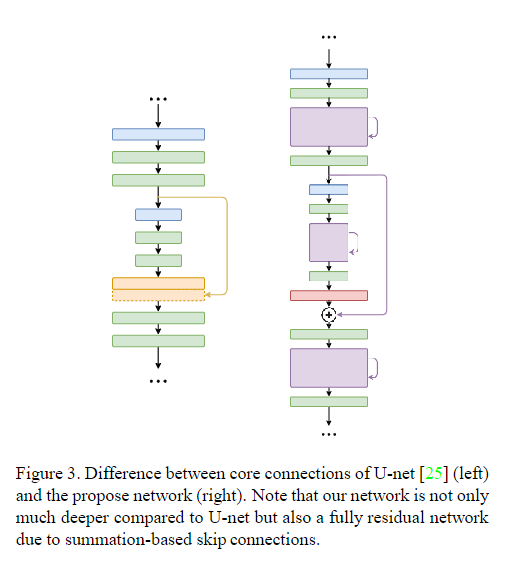
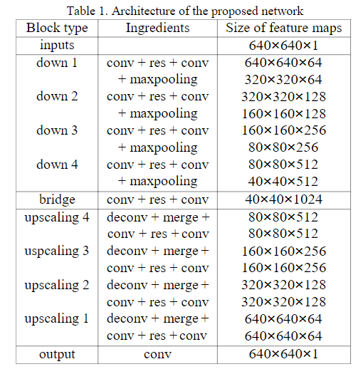
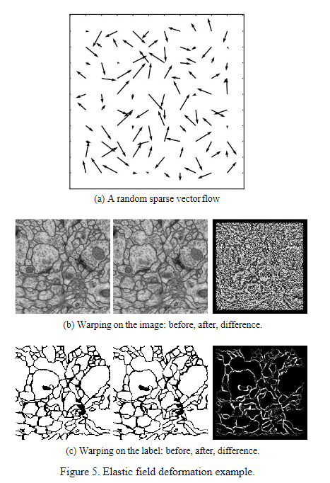

#  FusionNet

>A deep fully residual convolutional neural networkfor image segmentation in  connectomics

##  Abstract 

 连接组学研究的主要挑战之一是开发需要最小用户干预的可伸缩图像分析算法。 

fusionnet利用了语义分割和残差网络，引入了 summation-based的跳跃链接。

## Introduction

Unet在增加网络深度方面和传统的CNN有相似的局限性。因此本文在Unet的基础上，引入了残差网络来增加模型的深度，此外还加入了 summation-based的跳跃链接，使得整个网络层数更深。我们使用了翻转和旋转等数据增强方法。

## Related work

神经网路需要大量的数据去训练。

除了设计新的网络结构和数据增强外，还提出了一些后续的处理方法，比如multi-cut。  shortcut connections 和 direction summations 允许梯度跨越多个层次。

RNN也可以用于分割任务。

## Method

#### network architecture

 在编码路径中，每当进行下采样时，特征映射的数量都会增加。

在解码部分，每层特征映射的数量减半，以保持网络的对称性。每个残差块都有两个卷积层。这些卷积层作为连接输入特征映射和残差块的连接器，因为前一层的特征映射的数量可能与残差块的数量不同。

####  Data augmentation

*  Data  enrichment 
* Elastic  field  deformation： 首先初始化一个在边界处振幅消失的随机稀疏向量场(12 × 12)。然后将该字段插值到原始图像的大小，并用于弯曲两个图像对(原始数据和相应的标签) ，以形成新的图像对。采用随机生成流图的方法，使图像每个历元的变形程度不同。 

*  Random noise, boundary extension, random shuffle and  cross-validation 

####   Experimental Setup 

##  Results

*   Drosophila EM data 
*  Larval Zebrafish EM data 

##  Conclusion 

 FusionNet是U-net和残差CNN的一种新扩展，旨在开发更深层次的网络，实现更精确的端到端连接组图像分割。 