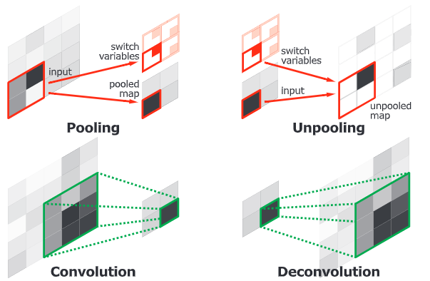

# DeconvNet

> Learning Deconvolution Network for Semantic Segmentation

## Abstract

反卷积网络由deconvolution和unpooling组成，可以预测像素级的label。

## Introduction

**Conditional random field (CRF)** is optionally applied to the output map
for fine segmentation 

FCN缺点：1. 由于感受域的大小固定，网络只能对图像进行单一尺度的语义分析。 小物体可能会被忽略，虽然增加了skip结构，也没有太大的改善。2.细节信息经常丢失或者被平滑化。

本文主要贡献：

* 提出了一种多层反卷积网络，由deconvolution、unpooling、ReLU组成。
* 将训练后的网络应用于单个对象，获得实例化的分割，并将这些分割组合在一起进行最终的语义分割。
* ？？？？？？？？？？？？？？？？？？在 PASCAL VOC 2012 取得了比较好的表现

## Related work

 FCN推动了最近基于深度学习的语义分割的突破。全连接层被反卷积层代替，去还原图像尺寸。可以在后续添加CRF来增加分割精度。

## System Architecture

### Acihitecture

分为卷积网络和反卷积网络。卷积网络是特征提取器， 反卷积网络对应于从卷积网络中提取的特征产生目标分割的形状生成器。 该网络最后输出的是与输入图像相同的概率映射，对每个像素进行类别预测。

### Deconvolution Network for Segmentation

##### Unpooling

 利用池化层提取感受野中的值，有助于分类，但是会丢失空间信息，影响语义分割所需的精确局部化。

为了解决这个问题，我们在deconvlution中使用unpooling，执行pooling的反向操作并还原原始大小。我们记录最大激活值的位置，在unpooling操作中将其放回原位。

##### Deconvolution

unpooling是一个放大但稀疏的激活映射。反卷积层通过多个滤波器进行类卷积操作来获得激活值。和卷积相反的是他是一个输入值对应多个输出值。我们可以通过裁剪扩大激活映射的边界来保持输出映射的大小。

反卷积层用来重建输入对象型状，每个反卷积层用来捕获不同层次的型状细节。较低的层倾向于捕获物体整体型状，较高的层倾向于特定类别的细节

##### Analysis of Deconvolution Network

unpooling和deconvolution有不同的作用。unpooling通过记录原始位置并将其还原来捕捉example-specific structure，他重建了更高分辨率物体的细节结构。而deconvolution的卷积核倾向于捕捉 class-specific shapes，通过反卷积，与目标类密切相关的激活被放大，而来自其他区域的噪声激活被有效抑制。 

### System Overview

算法将语义分割问题转化为实力分割问题。将一个可能包含对象的子图输入来生成输出。然后将所有方案的输出聚合到原始图像空间，从而得到整个图像的语义分割。

### Training

#####   Batch Normalization 

使用BN降低内部协变量移位的问题。BN将每层的向量标准化为标准高斯分布。

#####  Two-stage Training

先使用小批量数据去训练网络，然后使用更多的数据去训练。

###  Inference

给定一个输入标注，首先生成足够数量的候选标注，然后应用训练好的网络获得单个标注的语义分割图。然后对所有方案的输出结果进行分割，得到整个图像的语义分割结果。可以将该网络与FCN结合起来去提高性能。

#####  Aggregating Instance-wise Segmentation Maps

* 不懂

#####  Ensemble with FCN 

我们的网络适用于捕获细节信息，而FCN适用于捕获整体信息。

计算两组输出的均值，应用CRF进行最终的语义分割。

###  Experiments

####  Implementation Details 

* Network Configuration 

* Dataset：PASCAL VOC 2012 

* Training Data Construction: two-stage training strategy

  第一阶段训练

  使用ground-truth标注来裁剪目标实例，使目标在裁剪的边界框中居中，然后进行训练。这有助于减少对象位置和大小的变化。

  第二阶段训练

  使用更具挑战性的例子。这些例子是由重叠的ground-truth 分割的区域建议生成/裁剪的。

* Optmization: initial learning rate, momentum and weight decay are
  set to 0.01, 0.9 and 0,0005 。使用ILSVRC数据集对vgg16进行权值初始，用标准高斯分布初始化反卷积网络中的值。使用了BN，去掉了Dropout。

*  Inference：生成2000个建议目标，并选取评分前50个。

#### Evaluation on Pascal VOC 

##  Conclusion 

集成FCN和Deconvnet获得了更好的效果