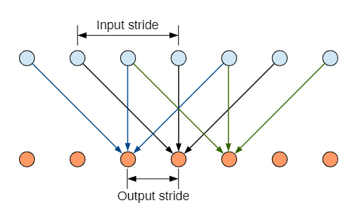
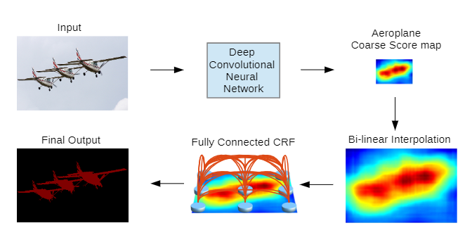
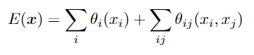
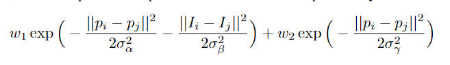
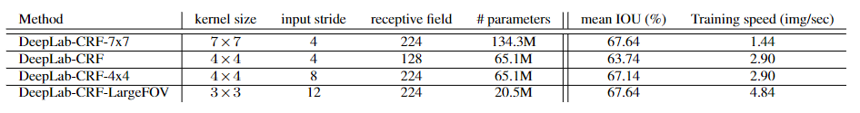

# DeeplabV1

> Semantic image segmentation with deep convolutional nets and fully connected CRFs

## Abstract

通过结合DCNN最后一层的响应喝条件随机场（CRF）克服了深层网络局部化性能差（因为DCNN具有不变性，the very invariance properties）的缺点。

使用了带孔洞的卷积核（hole）。 

## Introduction

cv的成功可以部分归因于dcnn对局部图像转换的内置不变性，这巩固了它们学习数据分层抽象的能力。但是这种特性对于高层的视觉任务友好，对低级的视觉任务（我们需要精确的定位而不是抽象的空间细节）不利，比如姿态估计（  pose estimatio ）、语义分割（semantic segmentation）。

 将dcnn应用于图像标记任务有两个技术障碍:信号下采样和空间“不敏感性”(不变性)。 

信号下采样由pool层喝downsample造成，因此我们使用atrous convolution来解决这个问题

不变性是为了识别目标的需要，但是会限制空间的精度。通过添加CRF来提高捕捉细节的能力。

deeplab的三个有点：速度、精度、结构简单（DCNNs+CRFs）

## Related work

我们的方法将每个像素视为一个CRF节点，探索长期依赖关系，并使用CRF推理直接优化dcnn驱动的成本函数。 

## Convolutional Neural Networks for Dense Image Labeling

#### Efficient dense sliding window feature extraction with the hole algorithm

忽略VGG-16最后两层池化层，并且通过引入零值来提高他们的长度（2× in the last three convolution and 4× in the first fully connected layer ），修改池化层后的卷积核。我们通过保证卷积核的完整以及稀疏的特征图卷积采样（分别 stide 2 or 4）来保证计算效率。 
添加了**im2col函数**（可以将多通道特征图转化为向量块） 。

我们需要和原图一样大的类分图。模型得到的类分图十分平滑，因此允许我们使用**简单的双线性插（乘以8）**值将其分辨率提高到原图大小。值得注意的是，**FCN没有使用空洞算法，产生粗糙的分数图（降采样因子为32）**。这就使得必须学习上采样层，极大提高了系统的复杂度和训练时间。

#### Controlling the Receptive Filed Size and Acceleratiing Dense Computation with Convolutional Nets

 在重新设计网络进行密集分数计算时，需要明确控制网络的感受域大小（receptive filed size） 。减少感受野大小有利于提升计算速度。

## Detailed boundary recovery：Fully-connected conditional random fields and multi-scale prediction

#### deep convolutional networks and the localization challenge

卷积网络在分类精度和定位精度存在平衡点：带有很多池化层的深度网络适合分类任务，但是分类网络的不变性以及大的感受野使得不适合得到更加精确的信息。

最近的工作提出两个方向来研究定位问题。**第一个方法是利用网络不同层次的信息来估计更精确的目标边界。第二个方法是借助超像素表达，使用低层次的分割方法估计边界。** 

**我们提出新的方法：结合DCNN的识别能力和CRFs的精确定位能力** 

#### fully-connected condtional random fields for accurate localization

传统的CRF被用来平滑分割图的噪声，这些能量函数包含相邻节点的能量项，有利于对空间临近像素进行同标记分配。这些short range CRF主要用于清理构建在局部手工特征之上的弱分类器的虚假预测。

使用短距离的（short-range）CRFs不是很有效，因为我们的目标是恢复局部的细节结构，而不是进一步平滑。使用对比度敏感的能量以及local-range CRFs能够提高定位结果，但是仍然丢失了细节结构，并且需要解决高代价的优化问题。 

为了克服这些问题，我们使用fully-connected CRF model（全连接的CRF模型）。能量函数如下：

使用高斯核函数，核函数如下：

第一个kernel取决于所有的像素位置和像素颜色，第二个kernel取决于像素位置。超参数控制这gaussian kernels的“scale”.

#### multi-scale prediction

提出了一种多尺度的预测方法去提升边界的定位精度。在前四层pooling后面添加两层MLP（first：128 3X3，second：128，1X1），然后将所有特征图连接在最后一层特征图。所以softmax层共有5*128=640层特征图。有助于提高定位结果但是不如fully connected CRF效果好。

## experimental evaluation

#### dataset

PASCAL VOC2012，添加了 额外标注的数据，评价标准IoU

#### training

采用分段训练方式，训练CRF的时候固定DCNN

在imagenet上预训练VGG16，然后在VOC21上进行finetune。

mini-batch：20

lr：0.001（final classifier layer：0.01），multiplying lr 0.1 at every iterations

momentum:0.9

weight decay:0.0005

当微调DCNN之后，根据**核函数方程**，我们交叉验证全连接CRF。使用默认的超参数值，然后再100张图上搜索最优的参数。我们使用从粗到精的策略。 然后搜寻最优步长，将所有实验的平均场迭代次数固定为10次。

#### Evaluation on Validation set

使用CRF后提升了精度，允许模型准确地捕捉复杂的对象边界。 

#### Multi-Scale features 

 利用多尺度特性可以稍微细化对象边界 

#### Field of View（FOV）

#### Mean Pixel IOU along Object Boundaries

使用Miou作为衡量指标。

利用中间层的多尺度特征，利用全连接的CRF对分割结果进行细化，明显改善了对象边界周围的结果。 

#### Comparison with State-of-art

与FCN8s和TTI-Zoomout-16比，该模型在提取目标边界上更好。

####  Reproducibility

模型的实现

#### **Test Set Result**

测试结果

## Conclusion

结合了DCNN和CRF， 获得相对精确的结果，并且计算效率高。

还有很多可以优化的地方，比如将DCNN和CRF合并，形成端到端的训练模式，而不是分开训练。 

在模型训练中使用了弱监督的注释，即边界框或图像级别的标签。

在更高的层次上，该工作是卷积神经网络和概率图形模型的交叉。可以进一步研究这两种强大的方法之间的相互作用，并探索它们在解决具有挑战性的计算机视觉任务方面的协同潜力。 