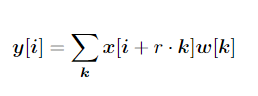
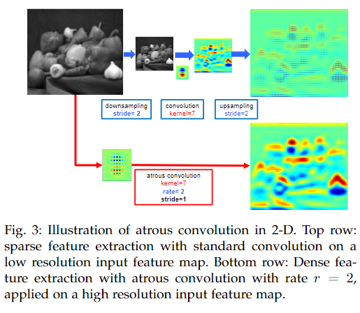
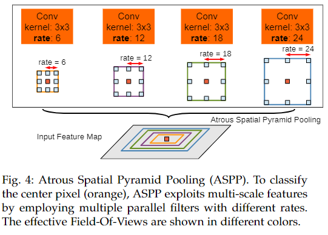
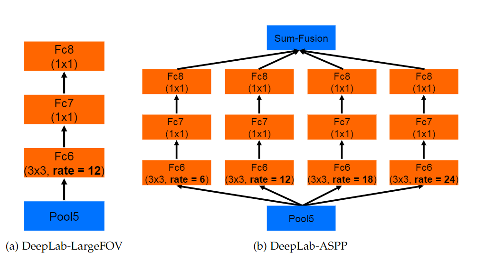
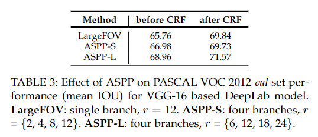

# DeeplabV2

> Semantic Image Segmentation with Deep Convolutional Nets, Atrous Convolution, and Fully Connected CRFs 

## Abstract

提出了三个有实用价值的点：

* 强调了上采样卷积核/空洞卷积核的作用。空洞卷积允许我们控制分辨率，在DCNN中计算特征响应。也允许我们扩大感受野去捕获更大的上下文信息而不需要增加参数和计算量。
* 提出了atrous spatial pyramid pooling（ASPP），提升了多尺度分割的鲁棒性。 ASPP使用多个采样率和有效视场的卷积核来检测传入的卷积特征，从而以多个尺度捕获目标和图像的上下文内容。
* 结合DCNN和概率图模型来提高物体边界的定位。DCNN中的最大池化和下采样组合实现了不变性，但牺牲了定位精度。通过组合DCNN最后一层的特征与CRF的特征来克服了这个问题。

## Introduction

不变性利于分类等高级任务，不利于逐像素分类的分割任务。

DCNN应用于语义分割有三个挑战：

1. 降低特征分辨率；

   池化和下采样会丢失空间信息。模型移除了DCNN最后几个pooling层的下采样操作，取而代之的是上采样操作。 Filter upsampling相当于在非0的filter中插入孔 。 该方案为在密集的预测任务中使用反卷积层提供了一个简单而强大的替代方案。 可以在不增加计算量的条件下扩大感受野。

2. 物体在多尺度上的存在；

   解决此问题的标准方法是向DCNN呈现同一图像的不同缩放版本，然后聚合特征或得分图，会提高计算量。

   受 spatial pyramid pooling的启发，我们提出了一种在卷积之前以多种比例对给定特征层进行重采样的高效计算方案。 相当于用多种滤波器来捕获多个尺度上的上下文。与其重采样特征，不如使用具有不同采样率的多个并行空洞卷积层有效地实现此映射。我们将所提出的技术称为（ASPP） 。

3. DCNN的不变性减少定位精度。

   一种方法是在计算最终分割结果时，使用skip layers从多个网络层提取hyper-column特征。 

    我们通过使用全连接的条件随机场（CRF），提高了模型捕获精细细节的能力。

   CRF已广泛用于语义分割中，将分类器计算出的类评分与像素和边缘或超像素的局部交互所捕获的低级信息相结合。 

将分类网络用于分割：

1. 将全连接层变为卷积层
2. 通过空洞卷积层提高特征分辨率，使我们能够每8个像素而不是原始网络中的每32个像素计算特征响应 

三个优点：速度、精度、结构简单

## Related work

过去十年中，大多数成功的语义分割系统都依赖于手工特征与平面分类器的组合。

第一类基于DCNN的语义分割系统通常采用一连串的自下而上的图像分割，然后再进行基于DCNN的区域分类。 

第二类工作基于使用卷积计算的DCNN特征进行密集图像标记，与多个独立获得的分割相结合（图切块，再对块进行分类，再利用多尺度进行修正结果）。 

第三类方法使用DCNN直接提供密集的类别级像素标签，这甚至有可能完全放弃分割。 

## Methods

####  Atrous Convolution for Dense Feature Extraction and Field-of-View Enlargement

之前的工作用deconvolution来弥补连续的pooling和striding带来的空间信息的丢失。

我们提出了使用atrous convolution，它支持我们去计算任何分辨率下的响应。

公式如下，速率参数r对应于我们对输入信号进行采样的步幅。

1-D情况：

2-D情况：

当我们使用factor为2的pooling的话，只能在1/4的像素点上得到响应，当使用r=2的atrous pooling时，可以在和原图相同的像素点上得到响应。在这个卷积中，我们对原始滤波器进行2倍的采样，并在滤波器值之间引入零。因此虽然响应区域增大，但是我们只需要计算非0处的响应，所以参数量和计算量都没有增大。

atrous可以让我们人以扩大感受野。我们在其中插入r-1个0，所以可以在不增加参数和计算量的情况下扩大感受野。

有两种方法实现atrous卷积：

1. 通过插入零来隐式的对卷积核进行上采样，或者稀疏的对输入的feature map进行采样。
2. **进行subample**

#### Multiscale Image Representations using Atrous Spatial Pyramid Pooling

两种方法应对语义分割中的尺度变化问题：

1. 进行标准多尺度处理
2. 通过对在单个尺度上提取的卷积进行重采样。

我们使用具有不同采样率的多个并行的atrous卷积，为每个采样率提取的特征在单个分支中进一步处理并融合。这就是ASPP。

#### Structured Prediction with Fully-Connected Conditional Random Fields for Accurate Boundary Recovery

DCNN的矛盾：定位精度和分类性能。不变性的增加和顶级节点的大感受野只能产生相对平滑的响应。

条件随机场（CRF）已用于平滑噪声分割图。short-range CRF的主要功能是清除基于本地手工设计功能构建的弱分类器的虚假预测。

因为我们需要得到边界细节，而不是使得预测图更加平滑，所以传统的CRF不利于分割任务。因此我们使用全连接的条件随机场（fully-connected CRF）。

**具体内容见V1**

## experimental results

使用预训练的VGG16或者Resnet101，并比较。

损失函数是CNN输出中每个空间位置的交叉熵项的总和。在整体损失函数中，所有位置和标签的权重均相等。

将DCNN和CRF分开训练。

在不同数据集上的效果

#### PASCAL VOC 2012

##### results from our conference version

* Field of View and CRF
* Test set evaluation

##### Improvements after conference version of this work

三个改进的点：

1. 不同的学习率
2. ASPP
3. 深层网络和多尺度处理

#### PASCAL-Context

#### PASCAL-Person-Part

#### Cityscapes

#### Failure Modes

分析失败的例子发现我们无法处理自行车和椅子等更加精细的边界，CRF处理后甚至无法恢复细节。**这是未来的工作。**

## Conclusion

通过atrous convolution和upsampled filter来提取密集的特征。

我们利用ASPP在多个尺度上提取上下文信息。

结合了全连接的CRF和DCNN来获取更加精细的边界信息。
