# Graph-FCN

> Graph-FCN for image semantic segmentation

## Abstract

深度学习在图像语义分割的高级特征提取中往往忽略了局部位置信息。为了避免这一问题，我们提出了一种基于全转换网络(FCN)初始化的图模型，Graph-FCN。

首先，通过卷积网络将图像网格数据扩展为图结构数据，将语义分割问题转化为图节点分类问题；然后应用图卷积网络来解决这个图节点分类问题。 

## Introduction

将像素视为点，节点之间的不同之处就像边缘。 最佳分割等价于图中的最大切割。并结合概率论和图论，应用马尔可夫随机场、条件随机场等概率图形模型方法对语义分割结果进行细化。这些方法将检测到的目标建模为图像中的节点，通过提取目标之间的关系来提高检测精度。与深卷积模型中输入数据的网格结构表示相比，该图模型具有更灵活的跳转连接，可以探索图中节点之间的各种关系。

GCN可以提取图的一个节点邻域内的特征，就想卷积网络中的卷积层和池化层一样。因为卷积过程中没有节点丢失，所以在扩大感受野的情况下也不会丢失细节信息。

##  Problem Formulation 

FCN使用卷积层提取感受野内的局部特征。然后使用上采样层恢复特征图到原始的图像大小。

 语义分割任务通常使用的交叉熵损失函数（对所有像素的标签图像） ：

y(i,j)为标签的真实标记，p为相应的概率。使用SGD优化cross-entropy loss L。

generalization有利于识别和分类，池化层增加感受野并降低分辨率，但会导致位置信息的丢失。

 FCN采用跳线连接融合不同尺度的特征层，我们使用FCN-16s作为basic model去初始化GCN的节点标注。

## Graph Model in Semantic Segmentation

GCN原本是为了图结构设计的。图结构可以表示为G(N,E,U)，N代表节点集（|N| * S的矩阵），|N|表示节点数，S是节点标注向量的维数。E是边集，U是图的特征，**分割中省略了U，因为它不在我们的任务中。**与欧几里得空间中的数据表示不同，N和E的表示不唯一。N和E相对应， 它们是按节点的顺序排列的。 

n(j)表示图j中的节点集，t(j)表示标签中的节点集，因为任务的图模型为

T(r)表示训练集，loss function： cross entropy function 

### Node

使用FCN-16s进行初始化，可以得到stride为16或32的feature map。 对于stride为32的feature map，通过因子为2的上采样，可以得到与stride为16的feature map相同大小的feature map。 

x(j)的初始化表示是通过连接两个特征向量和每个节点在特征图中的位置得到的。这个表示包含局部感受野上的特征提取。 在训练过程中，我们通过汇聚原始标签图像来获取节点的标签 

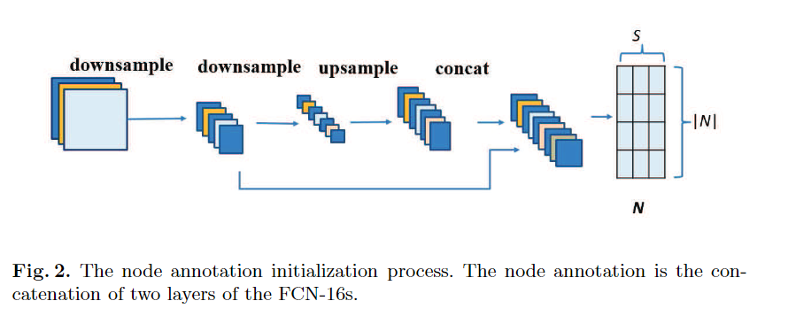

### Edge

边由邻接矩阵（adjacent matrix）表示。假设每个节点连接到他最近的L个结点。节点间的连接表示节点的标注可以通过图神经网络中的边来传递。 

使用以下实例来展示图神经网络中的感受野。

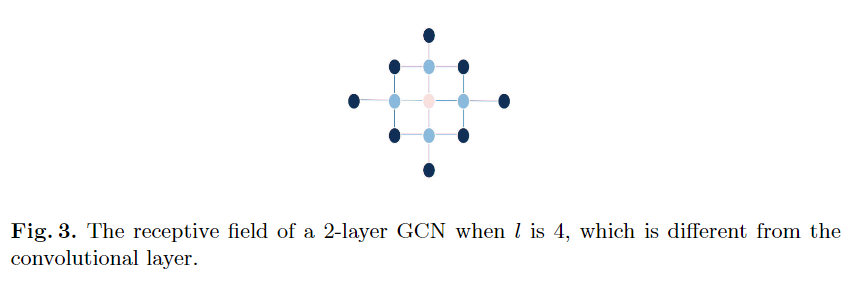

考虑到距离对相关性的影响，使用高斯核函数初始化邻接矩阵A的weight。

### Training with Graph-FCN

对于图来说，规范化 Laplacian Matrix L（拉普拉斯矩阵） 的具有以下形式

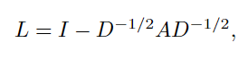

D是对角度矩阵：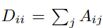

L可以正交分解：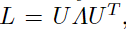

U是正交特征向量

Λ是特征值的对角矩阵

图的 fourier transform（傅里叶变换） 为：

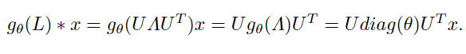使用切比雪夫多项式作为近似值：

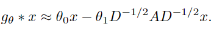

因为在一阶切比雪夫多项式中 θ0 = -θ1，

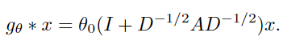

为了保证收敛性，采用下面方程为GCN中一层的算子，它充当了卷积层和池化层的角色，计算过程中特征在节点间传播  

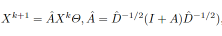

D_hat是I+A的度矩阵

GCN是一种拉普拉斯平滑。当消息在节点间传播时，相邻节点具有相似的特性。当前节点接收到的节点消息的最大范围可以作为图中的感受域。

因此GCN不能堆叠的太深。本文采用了2层GCN。

FCN-16s在一个比较小feature map中的实现了图模型的节点分类和初始化，然后使用2层GCN实现分类。

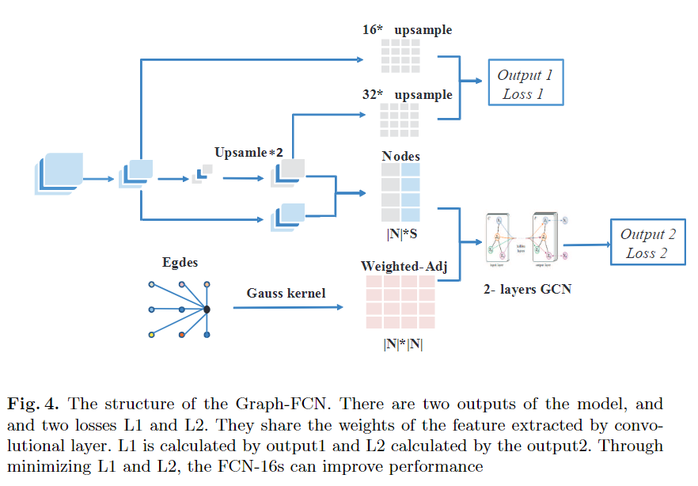

## Experiments

dataset：VOC2012

####  Implementation 

image size : 366 * 512

经过FCN-16s后得到512通道的feature map f1和4096通道的feature map f2，经过上采样可以使f2的size和f1相同，我们可以得到size为4096+512+2的图节点标注。

因为VOC中图像大小不同，所以将batch size设为1。FCN-16s采用预训练的权值，GCN部分随机初始化权值。

前8000次迭代中，以lr=0.1来调整GCN的参数，然后以lr=0.00001去训练整个网络。

weight decay：0.1

optimizer：Adam

#### Results

Graph-FCN模型中的GCN部分可以看作是一个特殊的损失函数。经过模型训练后，正向输出仍然是FCN-16s模型的输出。在测试中，Graph-FCN的前向部分与FCN-16s具有相同的结构，但通过增加GCN部分作为附加损失 。

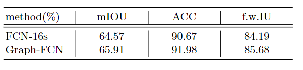

graph -fcn有更加平滑的效果，可能是因为应用了拉普拉斯平滑。graph -fcn能够从相邻节点中提取信息，有助于对当前节点进行分类。 

## Conclusion

Graph-FCN可以从更大的感受野上提取特征，对像素分类的特征提取也有所增强。