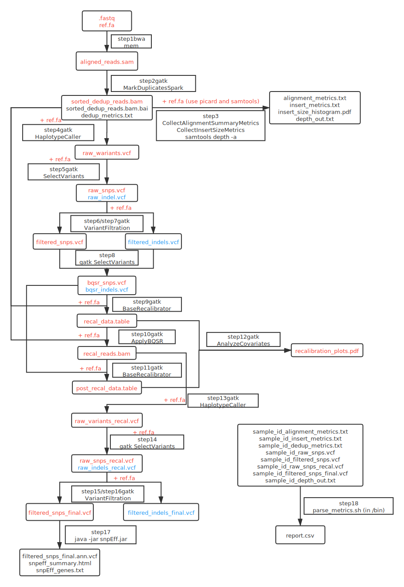
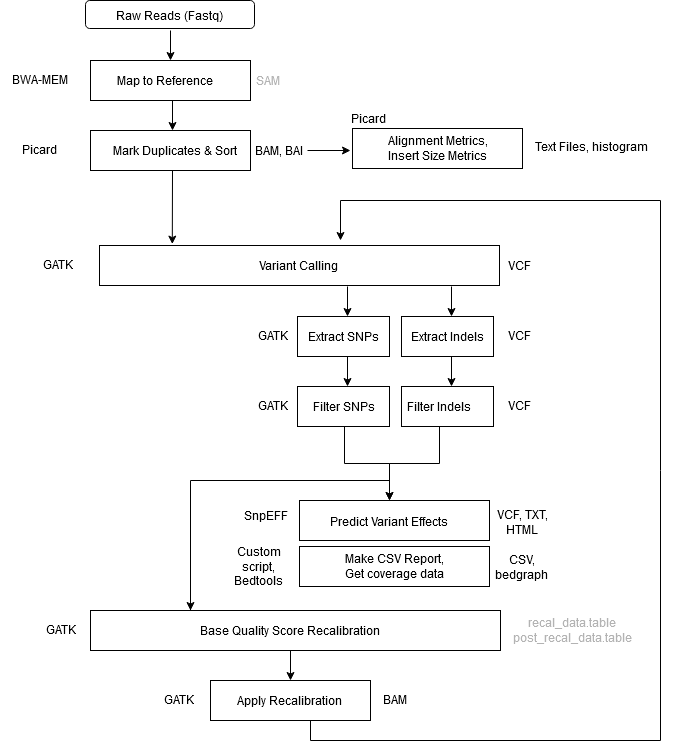

# GATK4大体流程

> 原文连接：https://gencore.bio.nyu.edu/variant-calling-pipeline-gatk4/

## 数据流图



## 流程图



## step1 Alignment – Map to Reference（比对）

* tool：bwa mem

* input：.fastq、reference genome（参考基因组）

* output：aligned_reads.sam（对齐的sam文件）

* notes：

  * -Y 使用软剪辑进行对齐补充
  * -K 不管有多少线程，处理每次批处理中的INT输入（reproducibility）
  * -R Readgroup信息由该标志提供。这些信息是下游GATK功能的关键。如果没有读组标记，GATK将无法工作。
  * 运行前需要**samtools faidx .fa、bwa index .fa**

* conmand：

  ```
  bwa mem \
  -K 100000000 \
  -Y \
  -R '@RG\tID:sample_1\tLB:sample_1\tPL:ILLUMINA\tPM:HISEQ\tSM:sample_1' \
  ref.fa \
  sample_1_reads_1.fq \
  sample_1_reads_2.fq \
  \> aligned_reads.sam
  ```

## step2 Mark Duplicates + Sort（标记重复和排序）

* tool：gatk MarkDuplicatesSpark
* input：aligned_reads.sam
* output：sorted_dedup_reads.bam、sorted_dedup_reads.bam.bai、dedup_metrics.txt
* notes：（不需要集群也可以运行）
  * 在GATK4中，使用MarkDuplicatesSpark工具将标记副本和Sam排序步骤组合成一个步骤。
  * 默认情况下还会创建BAM索引文件(.bai)。
  * 该工具被优化为在queryname-grouped对齐上运行(也就是说，所有具有相同queryname的读取都在输入文件中)。
  * BWA的输出是查询分组的，但是如果提供了坐标排序的对齐，该工具将花费额外的时间首先queryname对读取进行内部排序。
  * 由于MarkDuplicatesSpark在开始时在内部使用queryname-sorting coordinate-sorted 输入，因此无论输入排序顺序如何，该工具都会产生相同的结果。也就是说，不管输入的排序顺序如何，它将标记包含次要、补充和未映射的配对记录的重复集。这与给定不同排序的输入的Picard MarkDuplicates行为不同。(即坐标排序vs查询名排序)。

* command：

  * ```
    gatk MarkDuplicatesSpark \
                -I input.bam \
                -O marked_duplicates.bam
    ```

  * ```
    gatk \    
    MarkDuplicatesSpark \
        -I aligned_reads.sam \
        -M dedup_metrics.txt \ (可选的工具参数)
        -O sorted_dedup_reads.bam
    ```

## step3 Collect Alignment & Insert Size Metrics*

* tools：Picard Tools, R, Samtools

* input：sorted_dedup_reads.bam、reference genome

* output：alignment_metrics.txt、insert_metrics.txt、**insert_size_histogram.pdf**、depth_out.txt

* notes：**需要安装en_US支持，apt-get install language-pack-en**

* conmand：

  ```
  java -jar picard.jar \
          CollectAlignmentSummaryMetrics \
          R=ref.fa \
          I=sorted_dedup_reads.bam \
          O=alignment_metrics.txt
  
  java -jar picard.jar \
  CollectInsertSizeMetrics \
          INPUT=sorted_dedup_reads.bam \
          OUTPUT=insert_metrics.txt \
          HISTOGRAM_FILE=insert_size_histogram.pdf
  
  samtools depth -a sorted_dedup_reads.bam > depth_out.txt
  ```

## step4 call Varants

* tool：gatk HaplotypeCaller

* input：sorted_dedup_reads.bam、reference genome

* output：raw_variants.vcf

* notes：第一轮变量调用。在此步骤中识别的变量将被过滤，并作为基础质量评分重新校准(BQSR)的输入。运行前需要**picard CreateSequenceDictionary R=.fa O=.dict**

* command：

  ```
  gatk HaplotypeCaller \
          -R ref.fa \
          -I sorted_dedup_reads.bam \
          -O raw_variants.vcf
  ```

## step5  Extract SNPs & Indels（提取SNPs和Indels）#1

* tool：gatk SelectVariants

* input：raw_variants.vcf、reference genome

* output：raw_indels.vcf、raw_snps.vcf

* notes：分离SNPs和Indels，这样就可以被单独处理和使用

* command：

  ```
  gatk SelectVariants \
          -R ref.fa \
          -V raw_variants.vcf \
          -selectType SNP \ (我的gatk版本需要用-select-type)
          -O raw_snps.vcf
  gatk SelectVariants \
          -R ref.fa \
          -V raw_variants.vcf \
          -selectType INDEL \(-select-type)
          -O raw_indels.vcf
  ```

## step6 Filter SNPs

* tool：gatk VariantFiltration

* input：raw_snps.vcf、reference genome

* output：filtered_snps.vcf、filtered_snps.vcf.idx

* notes：

  * QD < 2.0 这是变量置信度(来自QUAL字段)除以non-hom-ref样本的未过滤深度。此注释旨在规范变量质量，以避免在深度覆盖时引起的膨胀。为了过滤的目的，使用QD比直接使用QUAL或DP更好。
  * FS > 60.0 这是该位点存在链偏差的Phred-scaled概率。链偏差告诉我们，与参考等位基因相比，替代等位基因在正向链或反向链上出现的频率是高还是低。当该位点的链偏小或无链偏时，FS值接近于0。
  * MQ < 40.0 这是站点上所有读取的均方根映射质量。该注释给出的不是该站点的平均制图质量，而是该站点制图质量平方和平均值的平方根。它的意思是包括制图质量的标准偏差。包含标准偏差允许我们在数据集中包含变化。低标准差意味着所有值都接近均值，而高标准差意味着所有值都远离均值。当一个站点的映射质量很好时，MQ将在60左右。
  * SOR > 4.0 这是另一种使用类似于对称优势比测试的测试来估计链偏差的方法。产生SOR是因为FS倾向于惩罚外显子末端的变异。外显子末端的读取往往只被一个方向的读取覆盖，FS给这些变体打了一个很差的分数。SOR将考虑涵盖两个等位基因的读值比率。
  * MQRankSum < -8.0:比较支持参考等位基因和替代等位基因的读取的映射质量。
  * ReadPosRankSum < -8.0:比较reads中参考等位基因和替代等位基因的位置是否不同。只在接近读序列末端的地方看到等位基因是错误的表现，因为这是测序者最容易出错的地方。
  * 在这一步被“过滤掉”的SNPs将保留在filtered_snps.vcf文件中，但是它们将被标记为' _filter '，而通过过滤器的SNPs将被标记为' PASS '。我们只需要提取并提供传递给BQSR工具的SNPs，我们将在下一步(步骤9)中完成这一工作。

* command：

  ```
  gatk VariantFiltration \
          -R ref.fa \
          -V raw_snps.vcf \
          -O filtered_snps.vcf \
          -filter-name "QD_filter" -filter "QD < 2.0" \
          -filter-name "FS_filter" -filter "FS > 60.0" \
          -filter-name "MQ_filter" -filter "MQ < 40.0" \
          -filter-name "SOR_filter" -filter "SOR > 4.0" \
          -filter-name "MQRankSum_filter" -filter "MQRankSum < -12.5" \
          -filter-name "ReadPosRankSum_filter" -filter "ReadPosRankSum < -8.0"
  ```

## step7 Filter Indels

* tool：gtak VariantFiltration

* input：raw_indels.vcf、reference genome

* output：filtered_indels.vcf、filtered_indels.vcf.idx

* notes：QD < 2.0、FS > 200.0、SOR > 10.0（同上）

* command：

  ```
  gatk VariantFiltration \
          -R ref.fa \
          -V raw_indels.vcf \
          -O filtered_indels.vcf \
          -filter-name "QD_filter" -filter "QD < 2.0" \
          -filter-name "FS_filter" -filter "FS > 200.0" \
          -filter-name "SOR_filter" -filter "SOR > 10.0"
  ```

## step8 Exclude Filtered Variants（排除筛选变异）

* tool：gatk SelectVariants

* input：filtered_snps.vcf、filtered_indels.vcf

* output：bqsr_snps.vcf、bqsr_indels.vcf

* notes：提取传递的变量，并将其作为输入提供给BQSR

* command：

  ```
  gatk SelectVariants \
          --exclude-filtered \
          -V filtered_snps.vcf \
          -O bqsr_snps.vcf
  gatk SelectVariants \
          --exclude-filtered \
          -V filtered_indels.vcf \
          -O bqsr_indels.vcf
  ```

## step9 BQSR#1（Base Quality Score Recalibration，基础质量分数重新校准）

* tool：gatk BaseRecalibrator

* input：sorted_dedup_reads.bam (from step 2)、bqsr_snps.vcf、bqsr_indels.vcf、reference genome

* output：recal_data.table

* notes：BQSR执行两次。第二次通过是可选的，只需要产生一个重新校准报告。

* command：

  ```
  gatk BaseRecalibrator \
          -R ref.fa \
          -I sorted_dedup_reads.bam \
          --known-sites bqsr_snps.vcf \
          --known-sites bqsr_indels.vcf \
          -O recal_data.table
  ```


## step10 Apply BQSR

* tool：gatk ApplyBQSR 

* input：recal_data.table、sorted_dedup_reads.bam、reference genome

* output：recal_reads.bam

* notes：此步骤将第一个BQSR步骤中计算的重新校准应用到bam文件。这个重新校准的bam文件现在可以进行分析。

* command：

  ```
  gatk ApplyBQSR \
          -R ref.fa \
          -I sorted_dedup_reads.bam \
          -bqsr recal_data.table \
          -O recal_reads.bam \
  ```

## step11 BQSR#2

* tool：gatk BaseRecalibrator

* input：recal_reads.bam、bqsr_snps.vcf、bqsr_indels.vcf、reference genome

* output：post_recal_data.table

* notes：这一轮BQSR是可选的。如果您想要使用Analyze Covariates步骤(**step13**)生成一个重新校准报告，那么它是必需的。对于这一轮的BQSR，您提供从上面的Apply BQSR步骤中获得的重新校准的读取作为输入。

* command：

  ```
  gatk BaseRecalibrator \
          -R ref.fa \
          -I recal_reads.bam \
          --known-sites bqsr_snps.vcf \
          --known-sites bqsr_indels.vcf \
          -O post_recal_data.table
  ```


## step12 Analyze Covatiates（协变量分析）

* tool：gatk AnalyzeCovariates

* input：recal_data.table、post_recal_data.table

* output：recalibration_plots.pdf

* notes：此步骤根据两次BQSR运行的输出生成一个重新校准报告。**需要R语言以及ggplot2、gplots、gsalib。**

* command：

  ```
  gatk AnalyzeCovariates \        
         -before recal_data.table \
          -after post_recal_data.table \
          -plots recalibration_plots.pdf
  ```

## step13 Call Variants

* tool：gatk HaplotypeCaller

* input：recal_reads.bam、reference genome

* output：raw_variants_recal.vcf

* notes：使用重新校准（分析就绪）的bam执行第二轮变量调用

* command：

  ```
  gatk HaplotypeCaller \
          -R ref.fa \
          -I recal_reads.bam \
          -O raw_variants_recal.vcf
  ```

## step14 Extract SNPs & Indels（提取SNPs和Indels）#2

* tool：gatk SelectVariants

* input：raw_variants_recal.vcf、reference genome

* output：raw_indels_recal.vcf、raw_snps_recal.vcf

* notes：分离SNPs和Indels，这样就可以被单独处理和使用

* command：

  ```
  gatk SelectVariants \
          -R ref.fa \
          -V raw_variants_recal.vcf \
          -selectType SNP \（-select-type）
          -O raw_snps_recal.vcf
  gatk SelectVariants \
          -R ref.fa \
          -V raw_variants.vcf \
          -selectType INDEL \（-select-type）
          -O raw_indels_recal.vcf
  ```

## step15 Filter SNPs

* tool：gatk VariantFiltration

* input：raw_snps_recal.vcf、reference genome

* output：filtered_snps_final.vcf、filtered_snps_final.vcf.idx

* notes：QD < 2.0、FS > 60.0、MQ < 40.0、SOR > 4.0、MQRankSum < -8.0、ReadPosRankSum < -8.0（具体见step6）

* command：

  ```
  gatk VariantFiltration \
  -R ref.fa \
          -V raw_snps_recal.vcf \
          -O filtered_snps_final.vcf \
          -filter-name "QD_filter" -filter "QD < 2.0" \
          -filter-name "FS_filter" -filter "FS > 60.0" \
          -filter-name "MQ_filter" -filter "MQ < 40.0" \
          -filter-name "SOR_filter" -filter "SOR > 4.0" \
          -filter-name "MQRankSum_filter" -filter "MQRankSum < -12.5" \
          -filter-name "ReadPosRankSum_filter" -filter "ReadPosRankSum < -8.0"
  ```

## step16 Filter Indels

* tool：gatk VariantFiltration

* input：raw_indels_recal.vcf、reference genome

* output：filtered_indels_final.vcf、filtered_indels_final.vcf.idx

* notes：QD < 2.0、FS > 200.0、SOR > 10.0、MQRankSum < -8.0、ReadPosRankSum < -8.0（具体见step7）

* command:

  ```
  gatk VariantFiltration \        
  -R ref.fa \
          -V raw_indels_recal.vcf \
          -O filtered_indels_final.vcf \
          -filter-name "QD_filter" -filter "QD < 2.0" \
          -filter-name "FS_filter" -filter "FS > 200.0" \
          -filter-name "SOR_filter" -filter "SOR > 10.0"
  ```

## step17 Annotate SNPs and Predict Effects（注释SNPs并预测效果）

* tool：SnpEff

* input：filtered_snps_final.vcf

* output：filtered_snps_final.ann.vcf、snpeff_summary.html、snpEff_genes.txt

* command：

  ```
  java -jar snpEff.jar -v \        
  <snpeff_db> \
          filtered_snps_final.vcf > $filtered_snps_final.ann.vcf
  ```


## step18 Compile Statistics（编制统计数据）

* tool：parse_metrics.sh (in `/bin`)
* input：sample_id_alignment_metrics.txt、sample_id_insert_metrics.txt、sample_id_dedup_metrics.txt、sample_id_raw_snps.vcf、sample_id_filtered_snps.vcf、sample_id_raw_snps_recal.vcf、sample_id_filtered_snps_final.vcf、sample_id_depth_out.txt
* output：report.csv

* command：

  ```
  parse_metrics.sh sample_id > sample_id_report.csv
  ```

  

```
SvDiscoverFromLocalAssemblyContigAlignmentsSpark 
StructuralVariationDiscoveryPipelineSpark
```

